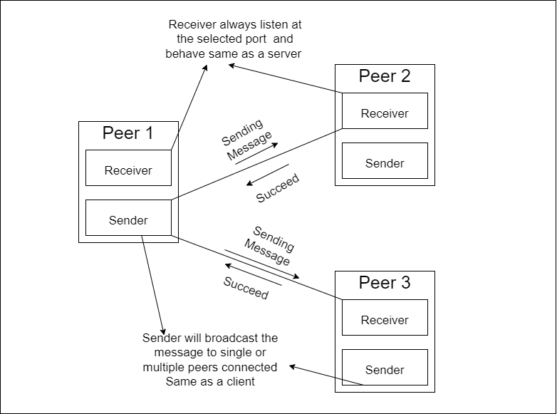

# This document describes the technologies and features used in this block-chain application - 

# Structure of Block
* Every block in the blockchain contains two parts, one is Header part and another one is Transactions part.

**Header** - It is one of the part in block used to identify a particular block on an entire blockchain. It is hashed repeatedly to create proof of work for mining rewards. It contains all the metadata suchas Sequence Number, version of the block, a cryptographic hash of the previous block, a timestamp, merkle root and the nonce. 

**Sequence Number** - It indicates the number of the block in the entire blockchain. System generates this number for a particular block by checking the previous block number. 

**Hash** -  It is done by passing some data through a formula that gives a result, called a hash. The hash of a transaction makes it easy to keep track of transactions on the blockchain. The parent hash of particular block links to the previous block and to its parent block, effectively securing the blockchain. 

**Version** -  It is useful in keeping track of changes and updates throughout the protocol. 

**Previous Hash** -  The previous hash field is inside the blockheader and thereby affects the current block hash. The child block hash is changes if the parent's hash changes. When the parent is modified in any way, then the  parent's hash is changes. Raclettehash has no parent hash and it’s sequence number is 0. 

**Merkle root** - Merkle root is the hash of all the transactions that are part of a block in a blockchain network. It is then used as a field in a blockheader, which means that every blockheader will have a short representation of every transaction inside the block. 

**Timestamp** - It is nothing but a date and time in which the event is happening. In our system, it is to determine at which moment the block has been mined and validated by the blockchain network. 

**Difficulty Target** - Difficulty is a measure of how difficult it is to mine a block in a blockchain for a particular blockchain. A high difficulty target means it takes additional computing power to verify transactions entered on a blockchain. 

**Nonce** -The nonce is the short form for Number Only Used Once is a number added to an encrypted block in a blockchain.  A cryptographic nonce can be combined with data to produce different hash digests per nonce: hash (data + nonce) = digest.

# Blockchain 
* Blockchain is “a distributed datastructure that contains transactional records across many computers and it continuously stored those transactions in the form of Blocks. These blocks are linked using cryptography. Every block contains blockheader, transition counter and transaction data. It is considered very secure by it's design. 
* Blockchains are generally managed through a peer-to-peer network for use as a distributed ledger. It means it is completely open to everyone in the network. Each transaction on a blockchain is secured with a digital signature that proves its authenticity. Due to the use of encryption and digital signatures, once a transation message is stored on a blockchain, it is extremely difficult to change it.
* While transactions takes place on a blockchain, there are peers on the network that validate these transactions. They use the concept of proof-of-work in order to process and validate transactions on the network. In order for a transaction to be valid, each block must refer to the hash of its preceding block. The transaction will add only if the hash is correct. 

**proof-of-work** - system requires scanning for a value that starts with a certain number of zero bits when hashed. This value is known as a nonce value. The number of leading zero bits is known as the difficulty. The average work required to create a block increases exponentially with the number of leading zero bits, and therefore, by increasing the difficulty with each new block, we can sufficiently prevent users from modifying previous blocks, since it is practically impossible to redo the following blocks and catch up to others.

* To initialize the blockchain we have to define the create_genesis_block. This creates an initial block with an index of 0 and a previous hash of 0. We implement the mining aspects of the block to add it in the chain.

# Peer to Peer Network(Architecture used here)

# Multi-Threading
* It means executing more than one thread at a time. In our system the tracker and peers handle more than one message at the same time. Peer can send transation mesaage to all the other connected peers in the network at a time.

# Socket Programming

# Asymmetric Cryptography 
## There are two types of cryptography
* Symmetric Key Cryptography
* Asymmetric key cryptography
- Here we are using Asymmetric Key cryptography 
#### Confidentiality and Authentication
* Every node has a Public key and Private Key
* During Sending the message first, the message is encrypted using sender' private key and then again encrypt the message using receivers public key and then send the message
* At the receiver side, receiver decrypt the message first using receivers private key and then again decrypt the message using senders public key.
#### Sending procedure - 
* Encrypted message = Encrypt(message,Private key of sender)
* Final Encrypted message = Encrypt(Encrypted message, Public key of receiver)
#### Receiving Procedure -
* Decrypted message = Decrypt(Final Encrypted message,Private key of Receiver)
* Final Decrypted message = Decrypt(Decrypted message,Public key of Sender)
#### Task need to complete here - 
* Create public key generator for nodes
* Create Private key generator for nodes
* Encryption of the message using private and public key of receiver and sender simultaneously
* Decryption of the message using private and public key of sender and receiver simultaneously

### But here we couldn't able to follow the above procedure. Here we used "rsa module" which is used to encrypt the message only using the receiver public key  and decrypt the message using the reciever's private key for confidentiality and also,we give a digital signature which is created using the senders private key and message which can be validation using the sender public key 
# Message Queue System

# Sqlite Database
Here two databases are there one is for the Peer and other for the Tracker

### Tables Created for the Peer Database
|Table Name |Uses|
|--------|--------------|
|BlockChain|Copy of the BlockChain/CheeseChain|
|Ledger|Contain Multiple transaction carried out by the peers in the network.After mining the ledger table will be reset|
|Mine Complete|Mine Complete status from the other peers. After mining peer check for this message in this table.If the message is there then cancel the mining process and reset the table|
|Peer Details|Details of all the connected elements in the network which is live|
|Transactions|It contain all the individual transaction between the peer.For this table every peer having different data|

### Table Created for Tracker Database
|Table Name |Uses|
|--------|--------------|
|PeerDetails|This table contain all the live connected peers in the network|
|RegisteredPeers|This table contain all the registered peers in the network which may currently offline or may be online|
