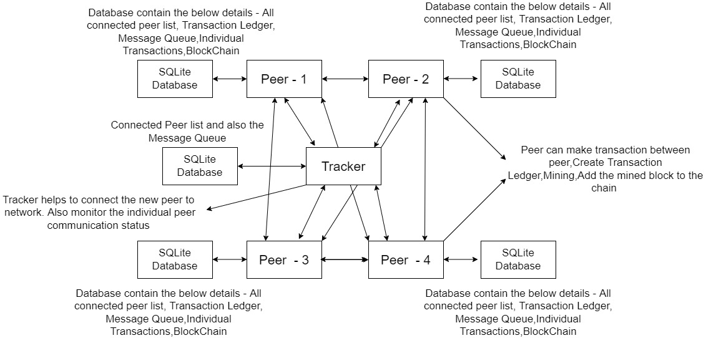

# Cheese Coin System (Block-Chain)

The goal of the project is to implement a blockchain -  peer-to-peer system inspired by Bitcoin.It uses a tracker  which help to add peers to the network and also, 
the Peer-to-Peer communication to share the data between the nodes in the cheese chain(Block-Chain)

## Project Members - 
- Arun Raveendran Nair Sheela

##Folder structure explanation
* BlockChain - 
    - CheeseCoin
      - BlockChain
        - BlockChain.py
        - BlockValidation.py
        - GenesisBlock.py
      - Blocks
        - BlockMining.py
        - CreateBlock.py
        - MerkelRootsCreation.py
      - Transaction
        - CreateTransactionData.py
        - CreateTransactionDictionaryLedger.py
        - CreateTransactionLedger.py
        - Decryption.py
        - Encryption.py
        - GeneratePublicPrivateKey.py
      - main.py
    - Database
      - BlockChain.py
      - CreateDatabase.py
      - Ledger.py
      - MineComplete.py
      - PeerDetails.py
      - Transaction.py
    - Network
      - MessageType - 
        - History.py
        - Join.py
        - KeepAlive.py
        - LastHash.py
        - MineComplete.py
        - NewBlock.py
        - Ping.py
        - SendNodeData.py
        - Transaction.py
        - TransactionLedger.py
      - RequestType
        - BroadcastMultiple.py
        - BroadcastSelected.py
        - ReceiveMessage.py
      - TrackerClient
        - Client.py
        - MessageCreationToTracker.py
      - Queue 
        - Queue.py
* Database - 
    - BlockChain.db
* Images - 
* Tracker - 
    - Database
      - Creation.py
      - MessageQueue.py
      - PeerDetails.py
    - DatabaseSource
      - Tracker.db
    - Queue
      - QueueThreading.py
    - Server 
      - Server.py
* AutoEvaluation.md
* CreateDB-Tables.py
* mainactions.py
* mainresponses.py
* protocol.md
* Readme.md
* Trackermain.py
##Procedure for starting the application

##Architecture of the System
